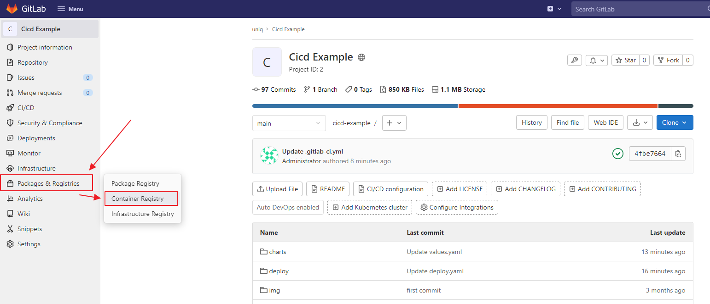
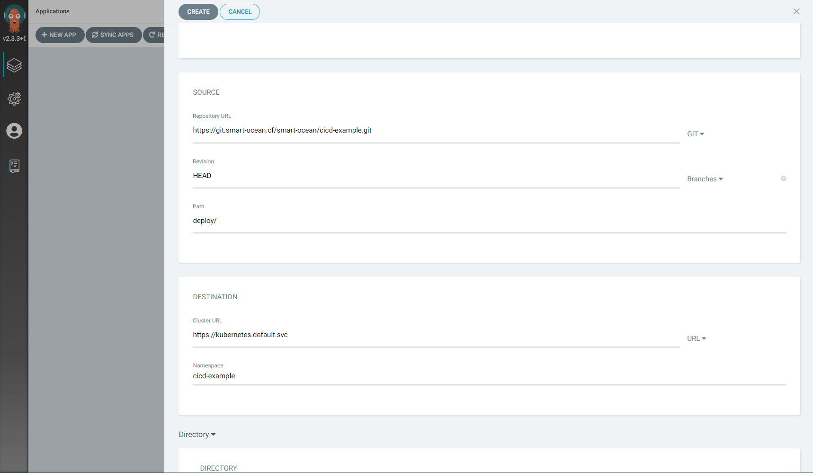

# CI 샘플 프로젝트 - Hello, World ! (Python/Flask)

- Create By [Taking](https://github.com/taking)

이 Repository는 진행했던 프로젝트 내 CI/CD 파이프라인 설계와 관련이 있으며, 지속적인 통합 (Continuous Integration)을 위한 샘플 프로젝트입니다.

파이썬(Python) 언어로 작성되었으며, 다음과 같은 과정 진행합니다.

- Docker Build

- Deploy

이 파일은 다음 링크를 통해 PDF 로 보실 수 있습니다. 

- [README.pdf](./README.pdf)

# 프로젝트 구조

프로젝트의 메인 파일은 다음과 같습니다.


- `charts/` : helm Chart 에 대한 정의 지정
  
  - Reference : https://helm.sh/docs/topics/charts/

- `deploy/` : ArgoCD  에 대한 정의 지정
* `.gitlab-ci.yml` : Gitlab CI 에 대한 정의 지정
  
  - Reference :  https://docs.gitlab.com/ee/ci/yaml/

* `Dockerfile` : 애플리케이션 빌드 및 패키징 방법 지정
  
  - Reference :  https://docs.docker.com/engine/reference/builder/

* `app.py` : Python 애플리케이션

* `requirements.txt` : Python 라이브러리 패키지 목록

> 루트 폴더 내에 필요한 파일은 `.gitlab-ci.yml`, `Dockerfile` 입니다.

# .gitlab-ci.yml 구조

```yaml
# 공통 variables 설정
variables:
  # Services
  SERVICE_NAME: $CI_PROJECT_NAME                      # 수정 X
  SERVICE_PORT: 8080                                  # 해당 부분 수정 필요합니다.
  SERVICE_NAMESPACE: $CI_PROJECT_NAMESPACE            # 수정 X
  TAG: $CI_COMMIT_REF_NAME-$CI_COMMIT_SHORT_SHA       # 수정 X
  # Registry
  REGISTRY_URL: registry.smart-ocean.cf                    # 수정 X
  REGISTRY_PROJECT: library                           # 경우에 따라 수정
  REGISTRY_ADDRESS: $REGISTRY_URL/$REGISTRY_PROJECT   # 수정 X
  REGISTRY_USER: harbor_free                          # 수정 X
  REGISTRY_PASS: password       # 수정 X

# CI 순서 설정
stages:
  - test
  - docker-build
  - docker-deploy
  - kubernetes-deploy
  - serverless-deploy
  #- helm


# test environment 설정
.test-environment:
  image: python:3.6
  before_script:  
    - pip install -r requirements.txt
    - pip install flake8 pytest pylint
  rules:
    - if: '$CI_COMMIT_BRANCH == "main"'
      # when: never
  #   - if: '$CI_COMMIT_TAG || $CI_COMMIT_BRANCH'


# 공통 environment 설정
.docker-environment:
  image: docker:stable
  services:
    - name: docker:stable-dind
      alias: docker
  variables:
    DOCKER_HOST: tcp://docker:2375/
    DOCKER_DRIVER: overlay2
    DOCKER_TLS_CERTDIR: ""
  after_script:
    - docker image prune -af
  rules:
    - if: $CI_COMMIT_BRANCH
    # - if: '$CI_COMMIT_BRANCH == "main"'
      exists:
        - Dockerfile


.gitlab-registry.environment:
  extends: .docker-environment
  before_script:  
    - echo $CI_REGISTRY_IMAGE:$TAG $PWD
    - echo $CI_JOB_TOKEN | docker login -u $CI_REGISTRY_USER $CI_REGISTRY --password-stdin


.harbor-registry-environment:
  extends: .docker-environment
  before_script:  
    - echo -n $REGISTRY_PASS | docker login $REGISTRY_ADDRESS -u $REGISTRY_USER --password-stdin

.helm-environment:
  image: alpine/helm
  before_script:
    - helm plugin install https://github.com/chartmuseum/helm-push.git
    - mkdir -p /root/.config/helm/
    - touch /root/.config/helm/repositories.yaml
  rules:
    - if: '$CI_COMMIT_BRANCH == "main"'
      # when: never
  #   - if: '$CI_COMMIT_TAG || $CI_COMMIT_BRANCH'


# Test
###########################################
Test:
  extends: .test-environment
  stage: test
  script:
    - python test.py test
    - pytest test.py
    - pylint -d C0301 *.py  --disable=missing-docstring
    - flake8 --max-line-length=120 *.py


# Docker
###########################################
Docker-Build:
  extends: .gitlab-registry.environment
  stage: docker-build
  script:
    - cat Dockerfile
    - docker pull $CI_REGISTRY_IMAGE:latest || true
    - >
      docker build --network host --cache-from $CI_REGISTRY_IMAGE:latest --tag $CI_REGISTRY_IMAGE:$TAG .
    - echo "t - $CI_REGISTRY_IMAGE:$TAG\n"
    - docker push "$CI_REGISTRY_IMAGE:$TAG"


gitlab-registry:
  extends: .gitlab-registry.environment
  stage: docker-deploy
  variables:
    GIT_STRATEGY: none
  script:
    - docker pull $CI_REGISTRY_IMAGE:$TAG
    - docker tag $CI_REGISTRY_IMAGE:$TAG $CI_REGISTRY_IMAGE:latest
    - docker push $CI_REGISTRY_IMAGE:latest

harbor-registry:
  extends: .harbor-registry-environment
  stage: docker-deploy
  script:
    - docker pull $CI_REGISTRY_IMAGE:$TAG
    - docker tag $CI_REGISTRY_IMAGE:$TAG $REGISTRY_ADDRESS/$CI_PROJECT_NAME:latest
    - docker tag $CI_REGISTRY_IMAGE:$TAG $REGISTRY_ADDRESS/$CI_PROJECT_NAME:$TAG
    - docker push $REGISTRY_ADDRESS/$CI_PROJECT_NAME:latest
    - docker push $REGISTRY_ADDRESS/$CI_PROJECT_NAME:$TAG

# Helm
###########################################
# helm-build-deployment:
#   extends: .helm-environment
#   stage: helm
#   script:
#     - helm package charts/
#     - helm cm-push charts/ -u=$REGISTRY_USER -p=$REGISTRY_PASS $REGISTRY_ADDRESS/$CI_PROJECT_NAME:latest
#     - echo "$REGISTRY_ADDRESS/$CI_PROJECT_NAME:latest"

kubernetes-deploy:
  image: bitnami/kubectl:latest
  stage: kubernetes-deploy
  script:
    - echo $KUBE_CONFIG |base64 -d > /.kube/config
    - |
      cat <<EOF | kubectl apply -f -
      apiVersion: v1
      kind: Namespace
      metadata:
        name: $SERVICE_NAMESPACE
      EOF
    - |
      kubectl create secret docker-registry regcred --dry-run=client -n $SERVICE_NAMESPACE \
        --docker-server=$CI_REGISTRY \
        --docker-username=$CI_REGISTRY_USER \
        --docker-password=$CI_JOB_TOKEN -o yaml > docker-secret.yaml
    - kubectl apply -f docker-secret.yaml
    - |
      cat <<EOF | kubectl apply -f -
      apiVersion: serving.knative.dev/v1 # Current version of Knative
      kind: Service
      metadata:
        name: $SERVICE_NAME-$TAG # The name of the app
        namespace: $SERVICE_NAMESPACE # The namespace the app will use
      spec:
        template:
          spec:
            containers:
              - image: $REGISTRY_ADDRESS/$CI_PROJECT_NAME:$TAG
                ports:
                  - containerPort: $SERVICE_PORT
            imagePullSecrets:
            - name: regcred
      EOF
    - sleep 3
    - echo $(kubectl get ksvc/$SERVICE_NAME-$TAG -n $SERVICE_NAMESPACE -o=jsonpath='{.status.url}')
```

# 파이프라인 확인 및 CI 방법

- 기본적으로 `.gitlab-ci.yml` 파일이 정의 되어 있고, Commit 시 자동으로 CI가 진행이 됩니다.


# Container Registry 확인

- `.gitlab-ci.yml` 샘플 파일을 기준으로 정상적으로 Container Build 및 Deploy 가 완료되었을 경우, Container Registry 를 통해 확인이 가능합니다.




# o 배포 방법

## 1. ArgoCD 를 사용하여 Kubernetes 에 지속적 서비스 배포 (GitOps)

- `/deploy/` 폴더 내 deploy.yaml 과 svc.yaml 을 수정합니다.

deploy.yaml

```yaml
apiVersion: apps/v1
kind: Deployment
metadata:
  name: cicd-example-deployment
spec:
  replicas: 3
  revisionHistoryLimit: 3
  selector:
    matchLabels:
      app: cicd-example
  template:
    metadata:
      labels:
        app: cicd-example
    spec:
      containers:
      - image: registry.smart-ocean.cf/library/cicd-example:latest
        name: cicd-example
        ports:
        - containerPort: 80
```

svc.yaml

```yaml
apiVersion: v1
kind: Service
metadata:
  name: cicd-example-svc
spec:
  ports:
  - port: 80
    targetPort: 80
  selector:
    app: cicd-example
```

- ArgoCD 에 접속합니다.
  
  - 로그인 아이디/비밀번호는 별도 알림


- Application name : cicd-example
- Project : default
- SYNC POLICY : Automatic
- 체크 - AUTO-CREATE NAMESPACE
- 체크 - RETRY (5)


- Repository URL : https://git.smart-ocean.cf/smart-ocean/cicd-example.git

- path : deploy/      # argoCD 를 위한 deploy 폴더가 설정 및 커밋 되어 있어야 합니다.

- Destination Cluster URL : https://kubernetes.default.svc

- Namespace : cicd-example




## 2. Knative 로 Kubernetes 에 Serverless 서비스 배포 (Knative)

- 위 Pipeline 예제 코드 중, kubernetes-deploy Stage 를 통해 배포를 진행합니다.

```yaml
# 공통 variables 설정
variables:
  SERVICE_NAME: $CI_PROJECT_NAME # 수정 X repository 프로젝트 이름으로 (자동 입력)
  SERVICE_PORT: 8080 # 해당 부분 수정 필요합니다.
  SERVICE_NAMESPACE: $CI_PROJECT_NAMESPACE # 수정 X 프로젝트 그프로젝트 이름으로 (자동 입력)
  TAG: $CI_COMMIT_REF_NAME-$CI_COMMIT_SHORT_SHA # 수main-0a653d6c
정 X

# CI 순서 설정
stages:
  - kubernetes-deploy

kubernetes-deploy:
  image: bitnami/kubectl:latest
  stage: kubernetes-deploy
  script:
    - echo $KUBE_CONFIG |base64 -d > /.kube/config
    - |
      cat <<EOF | kubectl apply -f -
      apiVersion: v1
      kind: Namespace
      metadata:
        name: $SERVICE_NAMESPACE
      EOF
    - |
      kubectl create secret docker-registry regcred --dry-run=client -n $SERVICE_NAMESPACE \
        --docker-server=$CI_REGISTRY \
        --docker-username=$CI_REGISTRY_USER \
        --docker-password=$CI_JOB_TOKEN -o yaml > docker-secret.yaml
    - kubectl apply -f docker-secret.yaml
    - |
      cat <<EOF | kubectl apply -f -
      apiVersion: serving.knative.dev/v1 # Current version of Knative
      kind: Service
      metadata:
        name: $SERVICE_NAME-$TAG # The name of the app
        namespace: $SERVICE_NAMESPACE # The namespace the app will use
      spec:
        template:
          spec:
            containers:
              - image: $CI_REGISTRY_IMAGE:$TAG
                ports:
                  - containerPort: $SERVICE_PORT
            imagePullSecrets:
            - name: regcred
      EOF
    - sleep 3
    - echo $(kubectl get ksvc/$SERVICE_NAME-$TAG -n $SERVICE_NAMESPACE -o=jsonpath='{.status.url}')
```

- Docker Build, Docker Deploy, Kubernetes Deploy 과정을 거칩니다.


- 현재 버전의 Docker Container 를 기준으로 Kubernetes 에 Deployments 과정을 거친 후, URL를 Return 해 줍니다.
- 


- URL 을 접속하여 확인합니다.


##### 
